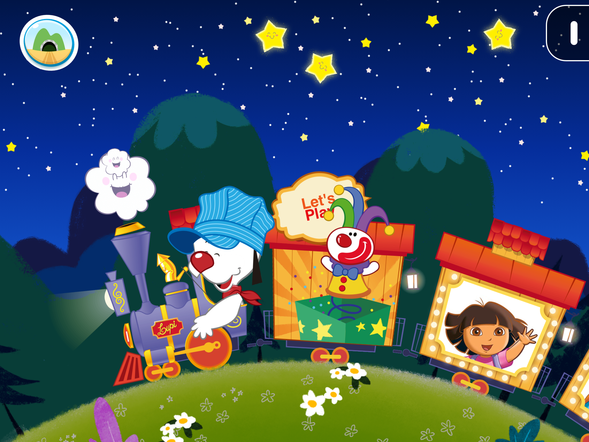
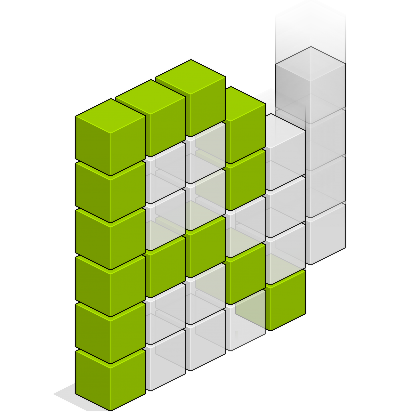
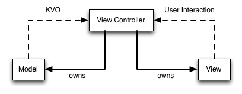
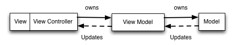

# [fit] Introdução a Reactive 
# [fit] Functional Programming.
# [fit] **_by Guilherme Martinez Sampaio_**

---


**_Guilherme Martinez Sampaio_**
iOS Developer
**_@gsampaio_**

---


---


---
# **_Agenda_**

- Functional Reactive Programming
- Reactive Cocoa
- Model View View Model
- Demo 
- Referências

---
# [fit] FUNCTIONAL 
# [fit] REACTIVE PROGRAMMING?

--- 


---
# [fit] Functional reactive programming
# [fit] is a programming paradigm for 
# [fit] **_reactive programming_**
# [fit] using the building blocks of 
# [fit] **_functional programming._** 

---

# [fit] FRP has been used for programming  
# [fit] GUI, robotics, and music,
# [fit] aiming to simplify these problems by explicitly
# [fit] **_modeling time._**

---
# [fit] Em outras palavras 
# [fit] descrevemos nossos programas 
# [fit] como eventos que reagem com 
# [fit] **_o tempo_**

--- 

# **_Reactive Cocoa_**



--- 
# [fit] RAC é uma biblioteca 
# [fit] que permite FRP em Objective-C
# [fit] desenvolvida pelo Github

---
# [fit] RAC é fortemente baseada no 
# [fit] RxExtensions da Microsoft para .NET

---
# [fit] RAC se baseia em 
# [fit] **_Signals_** e 
# [fit] **_Sequences_**

---
# [fit] Ao invés de usar **_variáveis_** 
# [fit] que são alteradas
# [fit] usamos **_sinais_** 
# [fit] que captura o 
# [fit] **_valor atual_** e 
# [fit] **_valores futuros._** 

---

# [fit] Sinais funcionam como 
# [fit] **_Promises_**

---
# [fit] Sinais tem 
# [fit] **_subscribers_**
# [fit] que escutam suas alterações

---

# [fit] Subscribers recebem 
# [fit] **_3 eventos_**

---
# [fit] NEXT

---
# [fit] Completed

---
# [fit] ERROR

---
# RACSignal
```objc

__block NSUInteger subscribers = 0;
RACSignal *signal = [RACSignal createSignal:^ RACDisposable * (id<RACSubscriber> subscriber) {
    subscribers++;
    [subscriber sendNext:@(subscribers)];
    [subscriber sendCompleted];
    return nil;
}];

[signal subscribeNext:^(id x) {
        NSLog(@"%@", x)
} error:^(NSError *error) {
        NSLog(@"ERRO 🔫");
} completed:^{
        NSLog(@"Signal completo");
}]

/**
Output:
1
Signal completo
**/

```
---
# [fit] Sinais são executados a
# [fit] a partir do momento que 
# [fit] ele tem um **_subscriber_** 
# [fit] até ele enviar um sinal de
# [fit] **_completed_**

--- 
# [fit] Sinais podem ter vários 
# [fit] **_subscribers_**

---
# [fit] Podemos compor sinais usando
# [fit] **_programação funcional_**

---
# RACSignal
```objc

__block NSUInteger subscribers = 2;
RACSignal *signal = [RACSignal createSignal:^ RACDisposable * (id<RACSubscriber> subscriber) {
    subscribers++;
    [subscriber sendNext:@(subscribers)];
    [subscriber sendCompleted];
    return nil;
}];

RACSignal *powSingal = [signal map:^NSNumber(NSNumber *value){
    NSUInteger intValue = [value unsignedIntegerValue];
    return @(intValue * intValue);
}];

[signal subscribeNext:^(id x) {
    NSLog(@"VALUE: %@", x);
}];

/** 
Outputs:
9
**/
```
---
# [fit] Collections podem gerar **_RACSequence_**
# [fit] que por sua vez podemos usar aplicar
# [fit] **_Programação Funcional_**

---

# RACSequence
```objc
NSArray *lettersArray = [@"A B C D E F G H I" componentsSeparatedByString:@" "];
RACSignal *letters = lettersArray.rac_sequence.signal;

[letters subscribeNext:^(NSString *x) {
    NSLog(@"%@", x);
}];

/**
Outputs: 
A B C D E F G H I
**/
```

--- 
# RACSequence
```objc
RACSignal *numbers = [@[@(1), @(2), @(3)].rac_sequence.signal;
RACSignal *pow = [numbers map:^NSNumber*(NSNumber *value){
    NSUInteger intValue = [value unsignedIntegerValue];
    return @(intValue * intValue);
}];

[pow subscribeNext:^(NSNumber *value) {
    NSLog(@"%@", value);
}];

/**
Outputs: 
1 4 9
**/
```

---
# [fit] RAC contem macros para 
# [fit] fazer **_data-binding_**

---
# RAC()
```objc
@interface ViewController ()
@property(nonatomic) NSUInteger *foo;
@property(nonatomic) NSUInteger *bar;
@end

@implementation ViewController 
- (void)viewDidLoad {
    self.foo = 0;
    self.bar = 0;
    NSLog(@"FOO: %@", @(self.foo));

    RAC(self, foo) = RACObserve(self, bar);
    self.bar = 1;
    NSLog(@"FOO: %@", @(self.foo));
}
@end
/**
Outputs:
FOO: 0
FOO: 1
**/

```
---
# MVVM


---
# [fit] Model View View-Model é 
# [fit] um Architectural Pattern
# [fit] semelhante ao MVC

---
# [fit] Model View Controller


--- 
# [fit] Mas na realidade 
# [fit] o que acontece é que ficamos com 
# [fit] **_view controllers gigantes_**

---
# [fit] Model View Controller


---
# [fit] Com MVVM movemos a 
# [fit] lógica de negocio 
# [fit] totalmente fora do VC
---
# [fit] E tratamos o VC como parte da View
# [fit] uma vez que ele trata 
# [fit] apresentação, rotação e navegação.
--- 
# [fit] Model View View-Model


--- 
# [fit] Para cada view criamos 
# [fit] um view model que trata ela.
# [fit] Usamos data binding para fazer comunicação.

---
# Model View View Model
```objc
@interface ViewController ()
@property(nonatomic, strong) ViewModel *viewModel;
@property(nonatomic, weak) UITextField *textField;
@property(nonatomic, weak) UILabel *label; 
@end

@implementation ViewController 
- (void)viewDidLoad {
    RAC(self.viewModel, text) = [self.textField rac_textSignal];
    RAC(self.label, text) = [self.viewModel expensiveComputation];
}
@end
```
---

# [fit] View Models **_facilitam_**
# [fit] **_escrever testes de uma view._**
# [fit] Uma vez que testamos o comportamento
# [fit] das views ao invés da view em si

---
# [fit] View Models pregam
# [fit] **_Composição sobre Herança._**

---
# [fit] Fazendo com que 
# [fit] Tenhamos um código
# [fit] **_mais reaproveitável._**

---
# [fit] Uma vez que podemos
# [fit] Plugar os view models
# [fit] que queremos nos nossos VC

---

# [fit] Com alguma excessões
# [fit] View Models são
# [fit] **_independentes de plataforma._**

---
# Demo


---
# [fit] Referências
- FRP - ```http://en.wikipedia.org/wiki/Functional_reactive_programming```
- Reactive Cocoa - ```https://github.com/ReactiveCocoa/ReactiveCocoa```
- Model View View Model - ```http://www.objc.io/issue-13/mvvm.html```

---
# [fit] Twitter

- @jspahrsummers
- @joshaber
- @rob_rix
- @indragie
- @ashfurrow

--- 
# Thanks


—

